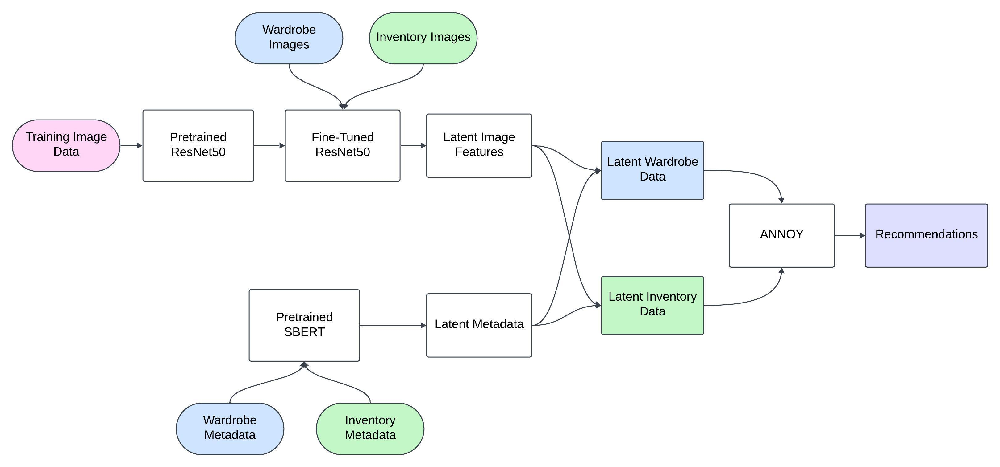
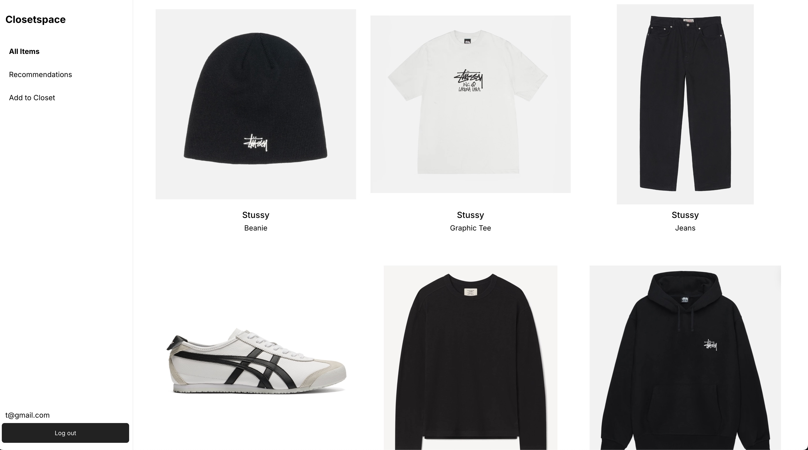
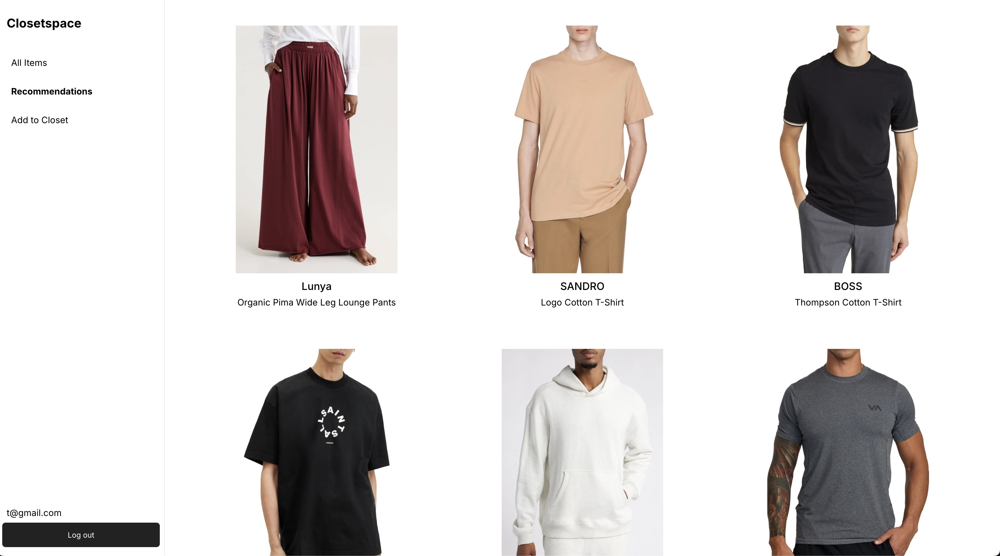

# Closetspace

A content-based recommender system that provides personalized fashion recommendations based on your wardrobe 

## Table of Contents

- [About](#-About)
- [Installation and Usage](#-Installation-and-Usage)
- [Motivation](#-Motivation)
- [Methodology](#-Methodology)
- [Results](#-Results)

## 📚 About
Closetspace is a wardrobe management app designed to help users build and maintain an intentional wardrobe that enhances their personal style. Users can upload images of their clothing items and view their entire wardrobe in a modern UI. The app analyzes the user's wardrobe content using machine learning to offer personalized recommendations that complement the user's style. By leveraging modern neural nets, Closetspace can pick up on nuances in a user's fashion choices while avoiding the need to collect tons of user data, which traditional recommender systems using collaborative filtering techniques fail to achieve in the fashion context. 

## 📝 Installation and Usage

Installation: fork the repository ([git docs](https://docs.github.com/en/pull-requests/collaborating-with-pull-requests/working-with-forks/fork-a-repo) found here)

Running the client
```console
cd closetspace
npm install serve -g
serve -s build -l 3000
```


Running the server
```console
cd server
pip install -r requirements.txt
npm i
npm run start
```

> [!NOTE]
> Both the client and server run on localhost. The server should run on port 5001 and the client should run on port 3000.

## 💡 Motivation
Many people, myself included, are interested in fashion and dressing to impress. The high prices of clothing in today's economy combined with the overwhelming number of clothing options and retailers, however, has made me regret many of the purchases I've made in the past. A good fashion recommender system can filter out the bad purchases and help you be more intentional about where your money goes. 


Existing systems have some notable flaws. 
1. Modern approaches based on collaborative filtering algorithms can lead to predictable and boring recommendations. Style is personal, and shouldn't be purely based on what other people like. These recommendations can lead to homogenity and be overly basic.
2. Low serendipity: apps like instagram use implicit data (e.g. sites you recently visited) to recommend to you items that you've already seen. There isn't a point in recommending to someone something that they were already actively searching for.
3. Systems don't take into account items you already have in your wardrobe. Perhaps the best indication of what someone's style is can be derived from what they have already bought, so why not use this data?


Closetspace's recommender system was built with these flaws in mind.

## 📊 Methodology



Closetspace uses a purely content-based approach to making recommendations. The setup is that we have an inventory dataset (~3000 unique products, ~7000 images scraped from [Nordstrom](https://www.nordstrom.com/)) from which recommendations can be drawn from and as input we take a user dataset with all items from a user's closet. Each item consists of two parts, the image of the item and metadata about the item, including the item name and brand. We use neural nets to embed both the image and metadata for all items into a smaller dimensional space which aims to capture the important latent information about an item. On a high level, items which are similar should have embeddings that are similar. Therefore, a natural approach to making recommendations, which we adopt, is to recommend items that have a similar embedding to items within a user's wardrobe. To capture information about a user's wardrobe as a whole instead of just individual items, we recommend items that have an embedding close to the mean embedding of all items in a user's wardrobe. 


To embed images into a lower dimensional space, we initially start with a pretrained [ResNet50](https://arxiv.org/pdf/1512.03385) model provided by PyTorch and removed the fully connected layer at the end used for classification. To make this model more suited to creating good embeddings for fashion items, we trained the model by treating it as an encoder and pairing it with a simple decoder, and optimizing for reconstruction loss. This is because good embeddings should be ones that can be fed through a decoder and reproduce the original image. We freeze the first 3 layers of the ResNet50 model during training to keep the learned information of its pretrained parameters. We used a [fashion dataset on kaggle](https://www.kaggle.com/datasets/paramaggarwal/fashion-product-images-dataset) with ~44k images for training. 


To embed the metadata, we simply fed the metadata through a [pretrained SBERT](https://huggingface.co/sentence-transformers/all-MiniLM-L6-v2). Then to produce a final embedding that takes into account both the image and metadata, we concatenated the image embedding with the metadata embedding. Lastly, we use the [approximate nearest neighbors oh yeah algorithm (ANNOY)](https://sds-aau.github.io/M3Port19/portfolio/ann/) with a euclidean distance metric to efficiently find similar embeddings and return recommendations.

> [!IMPORTANT]
> When making recommendations, we introduce a bit of gaussian noise to the inventory embeddings to make the recommendations non-deterministic. This is just so that a user can keep refreshing the page for additional recommendations.

## 🎯 Results

#### Sample Wardrobe


#### Sample Recommendations



Currently, the model is good at providing recommendations with high serendipity which still fall in line with the general aesthetic of the input wardrobe. However, there are some unanswered questions and areas for future improvement.
1. The model does not know the difference between a shirt and a pant and a shoe. Taking the mean latent representation of all items in an input wardrobe could lead to a meaningless value, a mix of a shirt and a pant and a shoe. How do we come up with a better representation? Should we partition items and recommendations into these predefined categories of product type? Doing so could lose some information.
2. The model similarly does not know the gender of the user or the gender of products. It would be easy to filter out inventory items by gender but should we? Some clothes are unisex and some people prefer the fit of clothing from the opposite sex (e.g. boyfriend hoodies and dad jeans).
3. A technical problem the model faces is finding a balance between the importance of the image vs. the metadata. Currently, the metadata embedding is quite large, but it does not capture much information because product names are quite abstract (what is the meaning of Dior Sauvage?).
